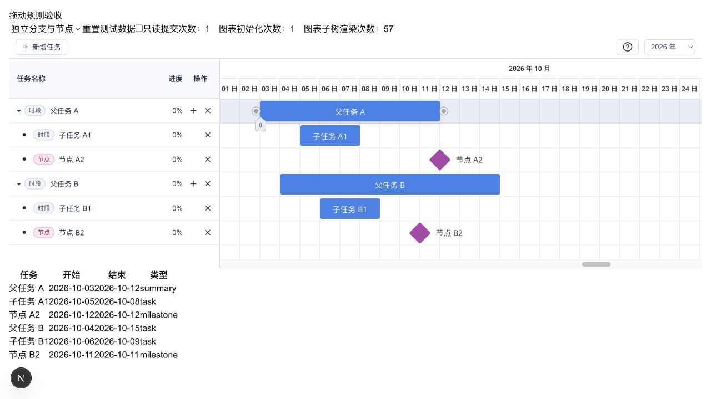
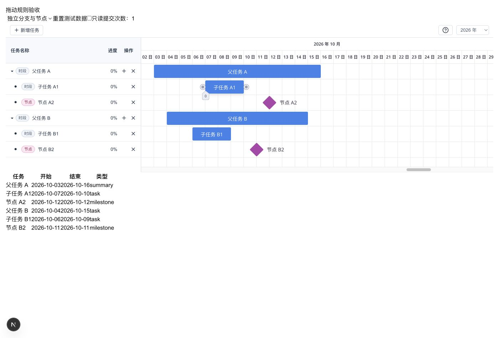
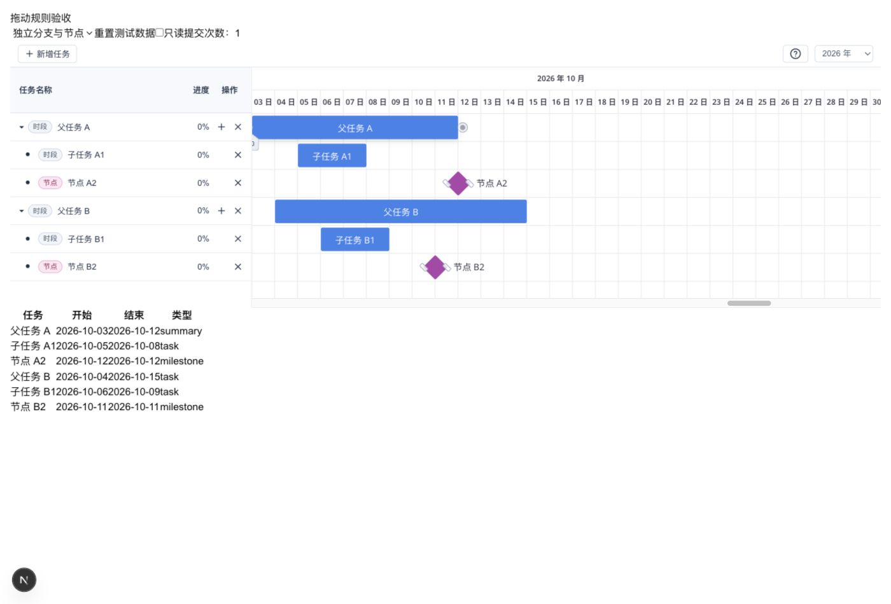
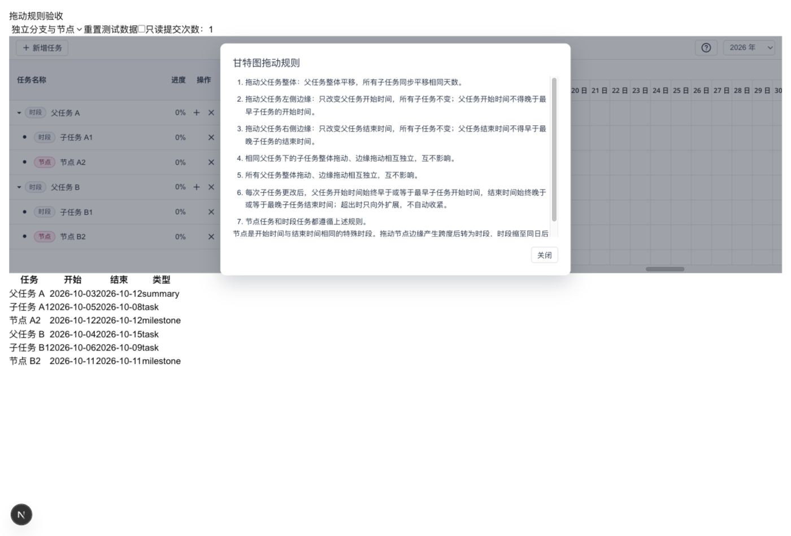

# 甘特图拖动规则浏览器验收

## 拖动性能修正回归（2026-10-07）

定位到日期组成的 React key 导致拖动中反复卸载、重建 Gantt。已删除该 key 和 React 预览状态，保留同一个 SVAR 实例。拖动按 requestAnimationFrame 合并更新，通过 SVAR API 只更新变化的可见任务；隐藏任务仍在最终业务快照中同步更新。松开时只提交一次，取消时恢复原日期。未变化任务保留对象引用，避免无关分支的复制、日期投影与图表更新。

使用实际内置浏览器、36px/天的独立测试数据重新操作；以下每项均核对日期表、提交计数和初始化计数。有效手势提交 1 次，无效手势提交 0 次。整个测试期间（代码热更新之外）图表初始化次数始终为 1。

| 操作 | 实际结果 |
| --- | --- |
| A 整体 +2 / -2 | 所有子任务同日数平移，B 分支不变 |
| 折叠 A 后整体 +2 | 隐藏 A1、A2 同步平移；折叠自身与拖动各提交一次 |
| A 左边缘 +5 / -2 | 限位至 10-05 / 向外扩至 10-01；子任务不变 |
| A 右边缘 -8 / -4 / +2 | 越界与恰好边界均止于 10-12；向外扩至 10-18 |
| A1 整体 +2 / +12 | 范围内保留父任务预留日期；越界仅扩展 A 至 10-20，兄弟和 B 分支不变 |
| B 整体 +2 | B1、B2 同步平移，A 分支不变 |
| A1 右边缘 -3，再左边缘 -2 | 10-05 节点，再转为 10-03 至 10-05 时段；连续手势提交计数 2 |
| A2 左边缘 -3 / 右边缘 +8 | 转为 10-09 至 10-12 / 10-12 至 10-20 时段；后者扩展 A |
| A2 右边缘 -2 | 保持节点，提交 0 次 |
| A 整体 -4，十月及跨年场景 | 分别跨至 09-29、2025-12-30，子任务同步平移 |
| 只读拖动与帮助弹窗 | 拖动无修改；按钮、遮罩、Escape 关闭通过，Tab/Shift+Tab 保持弹窗焦点，关闭后回到问号按钮 |

A 右边缘限位至 10-12 后，任务条右边缘与 A2 节点中心均为 756px，保存日期一致；圆形控件自身在任务条外侧，中心与日期边缘相差 7px，属于库原生控件布局。

这些检查确认已消除日期拖动导致的整图重建，并保留业务规则；未做与原生示例的 FPS 对照或大数据量基准，不据此宣称性能完全相同。图表子树渲染计数包含库自身局部更新，不等于整图初始化次数。取消恢复为代码路径，未通过真实 pointercancel 验收。

自动检查：19 项单元测试、类型检查、lint、组件库 ESM/CJS/类型声明构建通过。

## 圆形入口修正回归（2026-10-07）

删除自定义 `.kanx-resize-handle` 和任务条边缘缩放热区，复用 SVAR 的 `.wx-link.wx-left` / `.wx-link.wx-right` 圆形端点作为唯一日期缩放入口。源码确认这些端点原用于依赖创建，本组件现拦截其连线点击以避免冲突；已有依赖箭头显示保留。下方数字控件仍只调整进度。

在实际浏览器中使用上述原生圆形控件重新验证：父 A 左侧 +5 限位至 10-05、-2 扩至 10-01；右侧 -8 限位至 10-12；节点 A2 左侧 -3 与右侧 +3 转为时段；右侧 +8 扩展父任务至 10-20；节点右侧 -2 保持原值并提交 0 次；A1 右侧 -3 缩为节点。A 整体 +2 仍同步移动子任务，其他分支均保持独立。

另从 A1 任务条右边缘内侧 3px 拖动 +2，实际开始/结束同步变为 10-07/10-10，确认不再存在第二个边缘缩放热区。DOM 检查：自定义把手 0 个，每条任务的原生圆形端点 2 个。所有产生日期变化的操作提交一次。

最早任务左圆形端点曾被图表边界裁剪；初始视图增加一天留白后实际拖动通过。

以下为此前业务规则验收记录；此前截图中的自定义把手已移除，最新交互以本节为准。

验收日期：2026-10-07。环境：实际 Codex 内置浏览器，1400 × 950，开发服务 `http://localhost:3002/drag-test`。通过真实指针拖动操作组件，并读取页面中由 `onChange` 更新的完整日期表和提交计数；未用脚本直接修改业务状态。Chrome 外部连接不可用，改用可用的内置浏览器完成验收。

测试页面仅开发环境可访问，数据独立且不持久化。A 为 summary 父任务，B 为普通 task 父任务，用于验证按 parent_id 识别关系。

| 任务 | 初始开始 | 初始结束 | 父任务 |
| --- | --- | --- | --- |
| A | 2026-10-03 | 2026-10-16 | — |
| A1 时段 | 2026-10-05 | 2026-10-08 | A |
| A2 节点 | 2026-10-12 | 2026-10-12 | A |
| B | 2026-10-04 | 2026-10-15 | — |
| B1 时段 | 2026-10-06 | 2026-10-09 | B |
| B2 节点 | 2026-10-11 | 2026-10-11 | B |

除明确说明连续操作外，每项均先重置。正数表示向右，负数表示向左，单位为日历天。以下实际结果均符合预期。

| 规则 | 操作与预期 | 实际结果 |
| --- | --- | --- |
| 1 父任务整体平移 | A 整体 +2、-2；折叠 A 后整体 +2 | A、A1、A2 同步平移，包含隐藏子任务；B 分支不变 |
| 2 父任务左边缘 | A 左边缘 +2 恰好到最早子任务；+5 越界；-2 向外 | 前两项均止于 10-05；向外至 10-01，结束仍为 10-16，子任务不变 |
| 3 父任务右边缘 | A 右边缘 -4 恰好到最晚节点；-8 越界；+2 向外 | 前两项均止于 10-12；向外至 10-18，开始仍为 10-03，子任务不变 |
| 4 兄弟独立 | A1 整体 +2、-4、+12；左边缘 -4、+2；右边缘 +12、-2 | 仅 A1 日期修改，A2 不变；需要时 A 向外扩展 |
| 5 父任务分支独立 | B 整体 +2；左边缘 +5；右边缘 -8 | B 分支整体移动；边缘分别限位于 10-06、10-11；A 分支不变 |
| 6 父任务包容且只扩不缩 | A1 整体 -4、+12；A2 整体 -10、+7；子任务在父范围内移动或缩短 | A 左侧可扩至 10-01/10-02，右侧可扩至 10-19/10-20；范围内修改保留 A 原有预留时间 |
| 7 节点与时段一致 | A2 左边缘 -3、-10；右边缘 +3、+8；整体正反向拖动 | 正确转为时段，必要时扩展 A；A1 与 B 分支保持不变 |

## 补充验收

| 检查项 | 预期 | 实际 |
| --- | --- | --- |
| 时段转节点 | A1 右边缘 -3，或左边缘 +8 越过另一端 | 分别止于 10-05、10-08，同日且类型 milestone，无边缘交叉 |
| 节点转时段 | 上项 10-05 节点左边缘 -2 | 10-03 至 10-05，类型 task |
| 节点无效收缩 | A2 右边缘 -2 | 仍为 10-12 节点，最终版本提交次数为 0 |
| 单次提交 | 每次产生日期变化的完整手势 | 每次提交一次；连续手势与折叠操作分别计数 |
| 跨月 | A 整体 -4 | A 09-29 至 10-12；A1 10-01 至 10-04；A2 10-08；B 不变 |
| 跨年 | 选择跨年场景（初始日期改为 2026 年 1 月），A 整体 -4 | A 2025-12-30 至 2026-01-12；A1 01-01 至 01-04；A2 01-08；B 不变 |
| 视觉日期对齐 | A 右边缘 -4 后与 A2 节点中心对齐 | 两者横坐标均为 720px，差值 0px；保存日期均为 10-12 |
| 只读 | 勾选只读后拖动 A | 日期不变、提交 0 次、无边缘把手；帮助按钮可用 |
| 弹窗内容 | 七条规则及类型转换说明 | 内容完整，长内容内部滚动，关闭入口固定可见 |
| 弹窗关闭 | 关闭按钮、遮罩、Escape | 三种方式均关闭 |
| 键盘焦点 | 打开后聚焦弹窗；Tab、Shift+Tab 不离开；关闭后恢复 | 焦点位于关闭按钮，正反 Tab 均保持，关闭后恢复“查看拖动规则”按钮 |

最终指针捕获与无效操作优化后，重新验证了父任务整体移动、边缘越界限位、节点展开、节点无效收缩、跨月、跨年和像素对齐。

多层祖先扩展、隐藏后代、父节点转 summary、自定义非零时长类型保留，以及夏令时的本地日历天处理另有单元测试覆盖；不将这些单元测试当作浏览器验收。

## 自动检查

- `pnpm test`：18 项通过。
- `pnpm typecheck`：通过。
- `pnpm lint`：通过。
- `pnpm build:lib`：ESM、CJS、类型声明构建通过。
- `TZ=America/New_York pnpm test`：18 项通过，验证日期字符串和夏令时处理。

## 截图

